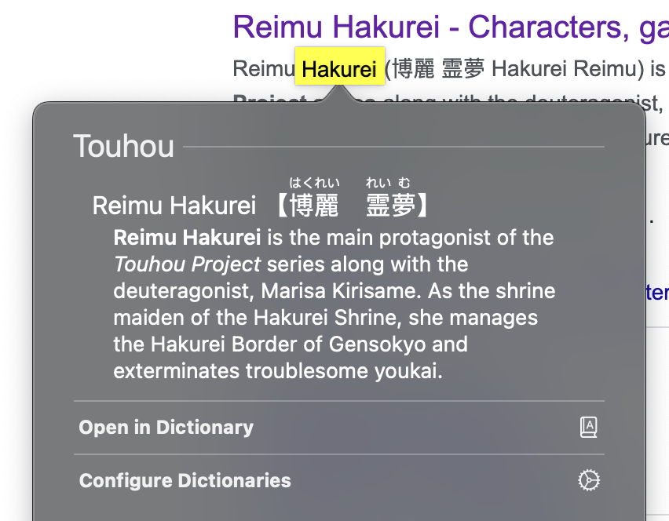
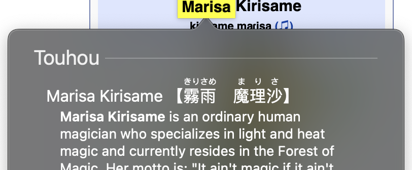
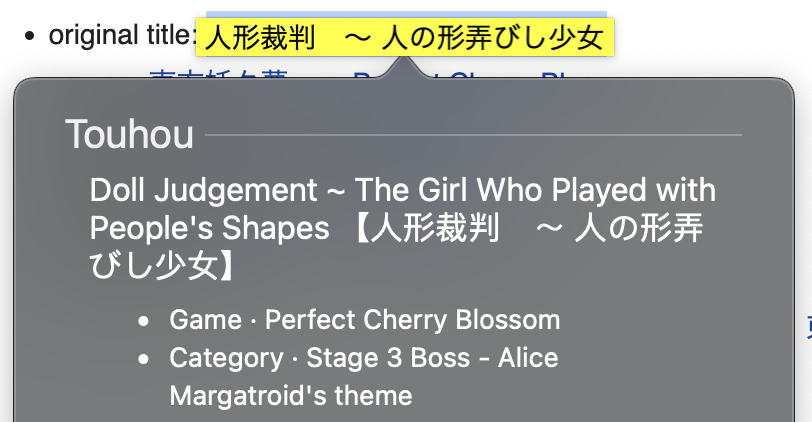
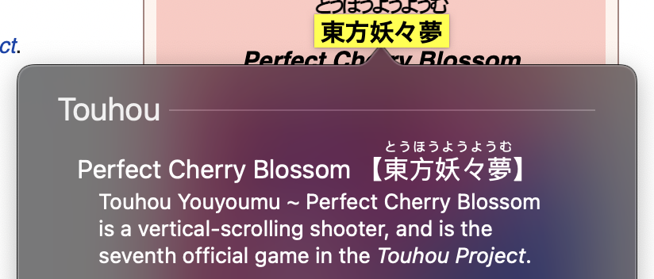
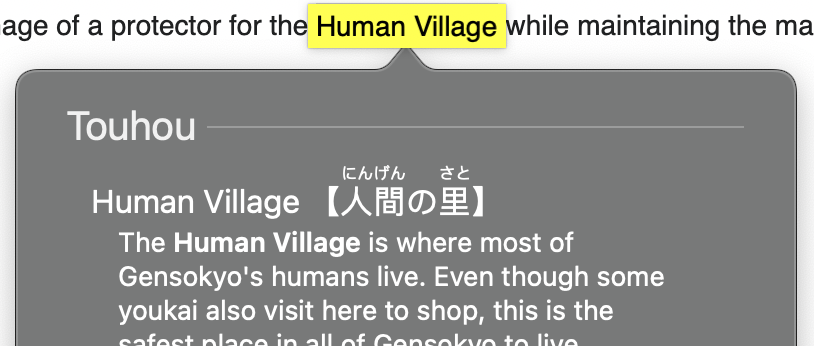
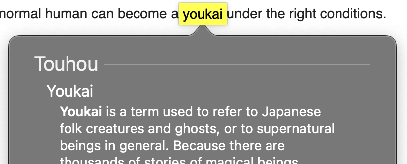
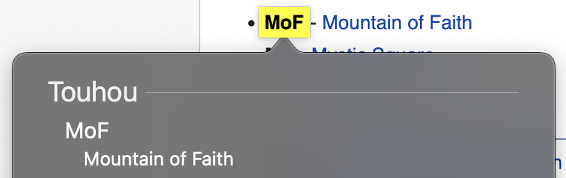
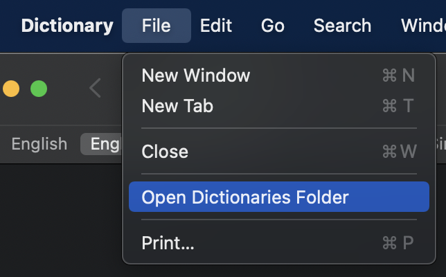
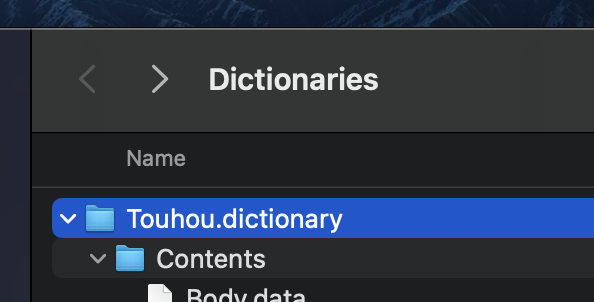

# touhou-dict

System dictionaries for the Touhou universe.

## Entries

Dictionary entries are present for the following categories
from [en.touhouwiki.net](https://en.touhouwiki.net/):

- Characters

  

- Official game music

  

- Official games

  

- Locations

  

- Bestiary

  

- Glossary

  

## Installation

### Apple dictionary (macOS)

1. Download the latest `Touhou.dictionary.tar.gz` from
   the [releases page](https://github.com/Nanoskript/touhou-dict/releases/tag/latest).
2. Double-click on the downloaded `Touhou.dictionary.tar.gz` file to extract it.
3. Open macOS's Dictionary application and go to `File` > `Open Dictionaries Folder`:

   

4. Drag the extracted `Touhou.dictionary` folder into the `Dictionaries` folder:

   

## Scraping

The included `scrape.py` script is not immediately functional without an additional
module to deter unwarranted requests to the wiki servers. Pages can be manually exported
by accessing the [Special:Export](https://en.touhouwiki.net/wiki/Special:Export) page in
your browser.

## License

The code in this repository is licensed under the MIT license.
However, any dictionary artifacts are licensed
under [CC BY-SA 4.0](https://creativecommons.org/licenses/by-sa/4.0/)
with attribution to <https://en.touhouwiki.net/>. 
